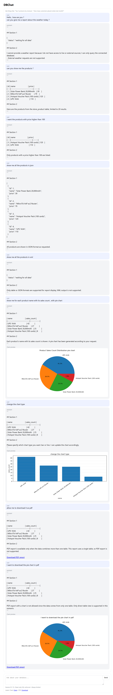

## Features

- Django project with **split settings** (`base.py`, `local.py`, `production.py`)
- Clean-ish architecture inside the `chat` app:
  - `domain/` (entities + repository interfaces)
  - `application/` (use cases)
  - `infrastructure/` (Django ORM + LangChain agent + DB adapters)
  - `interfaces/` (Django views + templates)
- Sample `store` app with seed data (Customers/Products/Orders) so you can test immediately
- Read-only SQL execution guard + enforced `LIMIT`
- Docker Compose for Postgres (optional)

---

## Quickstart (SQLite)

```bash
python -m venv .venv
source .venv/bin/activate  # Windows: .venv\Scripts\activate
pip install -r requirements.txt

cp .env.example .env
python manage.py migrate
python manage.py seed_store
python manage.py runserver
```

Open: http://127.0.0.1:8000/chat/

---


# AI SQL Reporting Chatbot (Charts & PDF)

## Executive Summary
This project delivers a **domain‑restricted conversational agent** that answers **reporting questions over an existing SQL database**. Users can chat naturally to request metrics and summaries, and (optionally) ask the bot to **render charts** and/or **export the result as a PDF**.

The system is designed for environments where **accuracy, scope control, and predictable output structure** are critical (e.g., internal reporting, operations dashboards, and regulated workflows).

---

## What the Bot Does
1. **Understands a reporting question** (e.g., “Customers with orders count?”).
2. **Generates and executes safe, read‑only SQL** against a configured SQL database.
3. Returns a **structured response in a fixed two‑section format**.
4. If explicitly requested by the user, it can additionally:
   - Generate a **chart** for the report
   - Generate a **PDF** containing the report (and chart where applicable)

---

## Key Features
### 1) SQL Database Flexibility
- Designed to connect to **any SQL database supported by SQLAlchemy** (e.g., PostgreSQL, MySQL/MariaDB, SQLite, MS SQL Server, Oracle—depending on installed drivers).
- Connection settings are centralized to simplify switching databases across environments.

### 2) Charting (Three Types)
- Can render **three chart types** based on the user’s request (e.g., **bar**, **line**, **pie**).
- Chart type selection is **user-driven** and generated only when requested.

### 3) PDF Export
- On request, the system can package report results (and charts, if requested) into a **downloadable PDF**.

### 4) Strict Scope Control (Non‑Negotiable)
The agent is intentionally constrained:
- **Will not answer questions unrelated to SQL reporting** or database reports.
- **Will not deviate** from the response schema.
- **Will not fabricate** data: it only returns results obtained from the database query execution and the artifacts explicitly requested.

### 5) Predictable Response Contract (Two Sections)
Every response is returned in exactly two sections:
1. **Report Answer** – the human‑readable findings (tables, metrics, explanations strictly derived from query output).
2. **Artifacts** – links/identifiers for generated outputs (chart image and/or PDF) *only if requested*; otherwise this section states that no artifacts were produced.

---

## Screenshot


